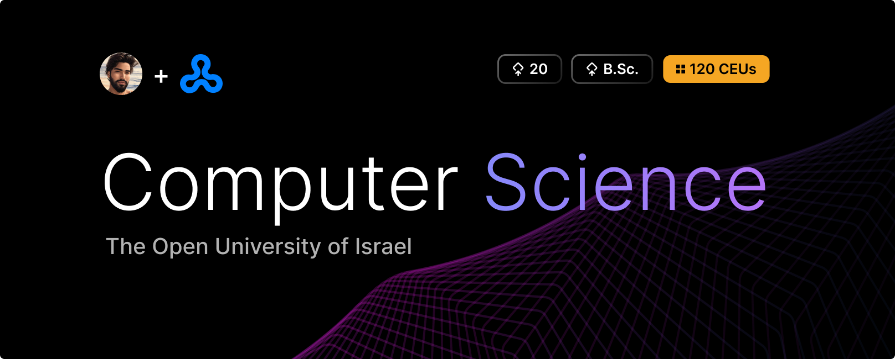

  <h1 align="center" style="border-bottom: none"><b>B.Sc. in Computer Science Path</b></h1>

  

    As a Computer Science Student in the <a href="https://openu.ac.il/"><b>Open University of Israel</b></a>, I am taking various courses and fulfilling other academic commitments.
     
    This organization stores repositories for the courses I’ve completed, am currently taking, or will take as part of my <b>Bachelor of Science in Computer Science</b> degree at OpenU. 
     
    It includes repositories for each course, containing projects, assignments, summaries, notes, and other course-related work.
     
    Feel free to explore any repository to dive into the course content and my learning journey.
     
     
    More information can be found <a href="https://academic.openu.ac.il/cs/computer/pages/default.aspx">Here</a>.
  

## Mathematics

<ul align="left">
  <li><a href="./link"><b>Discrete Mathematics (4 CEUs) »</b></a></li>
  <ul><li>⤷ A brief introduction for logic, Set Theory, Combinatorics, and Graph Theory.</li></ul>
   
  <li><a href="./link"><b>Linear Algebra I (7 CEUs) »</b></a></li>
  <ul><li>⤷ Systems of linear equations, The space Fⁿ, Matrices, Determinants, Finite fields, The field of complex numbers, Linear spaces, Bases and dimension theory, Linear transformations, Representation of transformations using matrices, Eigenvalues, Scalar product.</li></ul>
   
  <li><a href="./link"><b>Linear Algebra II (5 CEUs) »</b></a></li>
  <ul><li>⤷ Inner product spaces, Bilinear forms and quadratic forms, Canonical forms.</li></ul>
   
  <li><a href="./link"><b>Infinitesimal Calculus I (7 CEUs) »</b></a></li>
  <ul><li>⤷ Axioms of real numbers, Limits of sequences, Upper and lower bounds of sets, Partial limits, Limits of functions, Continuous functions and their properties, Uniform continuity, Exponential functions, The derivative and its applications.</li></ul>
   
  <li><a href="./link"><b>Infinitesimal Calculus II (7 CEUs) »</b></a></li>
  <ul><li>⤷ The definite integral, Integration methods, The improper integral, Taylor and Maclaurin series, Series, Sequences and series of functions, Differential calculus of functions of two variables.</li></ul>
   
  <li><a href="./link"><b>Probability and introduction to Statistics for Computer Science students (5 CEUs) »</b></a></li>
  <ul><li>⤷ Combinatorics, Axioms of probability, Conditional probability and independence, Random variables, Continuous random variables (General, Normal, Exponential, and Uniform), Joint distribution of random variables (Discrete), Properties of expectation, Limit theorems, Statistics.</li></ul>
   
</ul>

## Computer Science

<ul align="left">
  <li><a href="./link"><b>Introduction to Computer Science using Java (6 CEUs) »</b></a></li>
  <ul><li>⤷ Introduction and fundamentals of the Java language, Object-Oriented Programming: Using given classes and writing classes, Flow control (Conditional statements and loops), Arrays, Advanced OOP – Inheritance, Static methods and variables, Method overloading, Packages, Polymorphism and Interfaces, Algorithmic complexity, Sorting and searching algorithms, Recursion, Linked lists, Stacks and queues, Trees and binary trees, Computability at a glance.</li></ul>
   
  <li><a href="./link"><b>Data Structures and Introduction to Algorithms (6 CEUs) »</b></a></li>
  <ul><li>⤷ Growth of functions, Recurrence relations, Correctness proofs, Sorting, Finding the i-th smallest element, Heaps and their applications, Basic data structures, Hash functions, Binary search trees, Red-Black trees, Advanced data structures.</li></ul>
   
  <li><a href="./link"><b>System Porgramming Laboratory (5 CEUs) »</b></a></li>
  <ul><li>⤷ Fundamental knowledge of the C language and principles of structured programming, Familiarity with the structure of the Unix operating system using Ubuntu.</li></ul>
   
  <li><a href="./link"><b>Computational Models (5 CEUs) »</b></a></li>
  <ul><li>⤷ Finite automata and regular languages, Grammars, context-free languages, pushdown automata, Turing machines, equivalence of different computation models to Turing machines, Church-Turing thesis, Decidability: Universal Turing machine, Cantor’s diagonalization method, undecidability of the halting problem, Reductions: Undecidable problems, mapping reductions, Time complexity: Polynomial reductions, classes P and NP, Cook-Levin theorem, NP-complete problems.</li></ul>
   
  <li><a href="./link"><b>Computer Organization and Design (5 CEUs) »</b></a></li>
  <ul><li>⤷ Introduction - Abstraction of Computers and Technology, Processor performance evaluation, Number representation, Boolean algebra and Boolean functions, MIPS assembly, Procedure stack and its relation to programming languages, Combinational logic, building the ALU, Sequential logic and memory units, building the register file, Single-cycle processor, Processor performance improvement using pipelining, Large and fast: Leveraging memory hierarchies.</li></ul>
   
  <li><a href="./link"><b>Logic for Computer Science (4 CEUs) »</b></a></li>
  <ul><li>⤷ Introduction – Natural and formal languages, Propositional language – Grammar and meaning, Propositional calculus – Proof theory, Adequacy and compactness theorems, Predicate language – Grammar and meaning, Predicate calculus – Proof theory, Adequacy and compactness theorems, Introduction to model theory, Name structures (of Herbrand), Gödel’s incompleteness theorem and its implications, Many-sorted logic and second-order logic, Definability in first-order logic and second-order logic.</li></ul>
   
  <li><a href="./link"><b>Operating Systems (4 CEUs) »</b></a></li>
  <ul><li>⤷ Concepts underlying modern operating systems and their historical development, Process creation, scheduling, critical sections, and issues of synchronization and inter-process communication, Memory management, File systems, Input/Output facilities, Deadlock problem and methods for dealing with it, Virtualization, Security mechanisms, Structure of the Linux operating system.</li></ul>
   
  <li><a href="./link"><b>Programming Languages (4 CEUs) »</b></a></li>
  <ul><li>⤷ Operational understanding of fundamental concepts in the implementation of modern programming languages: values, abstract data structures, memory, control structures, variable binding, type systems, modules, and objects. Introduction to understanding the semantics of programming languages through the implementation of interpreters in a functional programming language.</li></ul>
   
  <li><a href="./link"><b>Database System Concepts (4 CEUs) »</b></a></li>
  <ul><li>⤷ Introduction to Database Systems, Relational model and relational algebra, Basic and advanced SQL, Entity-Relationship model, Relational model design, Complex data types, Overview of file storage, indexing, and query processing.</li></ul>
   
  <li><a href="./link"><b>Programming and Data Analysis with Python (6 CEUs) »</b></a></li>
  <ul><li>⤷ Language fundamentals, Flow control and conditional statements, Loops, Functions, Exceptional cases, Basic data structures, Advanced data structures, Recursion – basic and advanced topics, Efficiency – basic and advanced topics, Search and sorting – basic and advanced topics, Files, Object-oriented programming, Advanced object-oriented programming and dynamic code, Introduction to data analysis, Python packages – introduction to various packages for data analysis.</li></ul>
   
  <li><a href="./link"><b>Introduction to Computer Networks (4 CEUs) »</b></a></li>
  <ul><li>⤷ Introduction, Physical Layer, Data Link Layer, Medium Access Control Sub-layer, Network Layer, Transport Layer.</li></ul>
   
  <li><a href="./link"><b>Advanced Programming with Java (4 CEUs) »</b></a></li>
  <ul><li>⤷ Object-Oriented Programming, Creating a Graphical User Interface, Multithreaded Programming, Generic Programming and Collections, Communication and Client-Server Systems.</li></ul>
   
  <li><a href="./link"><b>Introduction to Artificial Intelligence (4 CEUs) »</b></a></li>
  <ul><li>⤷ Problem Solving with State-Space Search Algorithms, Heuristics, Local Search - Local Optimization for Solution Finding, Adversarial Games, Constraint Satisfaction Problems, Bayesian Networks, Markov Decision Process (MDP), Machine Learning – Learning from Examples, Decision Trees.</li></ul>
   
  <li><a href="./link"><b>Biological Computation (4 CEUs) »</b></a></li>
  <ul><li>⤷ Cellular automata: The Game of Life; Evolutionary Computing: Genetic Algorithms, Genetic Programming; Artificial Neural Networks: Hopfield Networks, The Perceptron, Restricted Boltzmann Machines; Molecular Computing: DNA-based Computing, Enzyme-based Computing; Data Storage using DNA.</li></ul>
   
</ul>

 

## Contributing

Pull requests are welcome. For major changes, please open an issue first to discuss what you would like to change.

## License

[licensed under MIT](https://github.com/ladunjexa-pbl/.github/blob/main/LICENSE)
